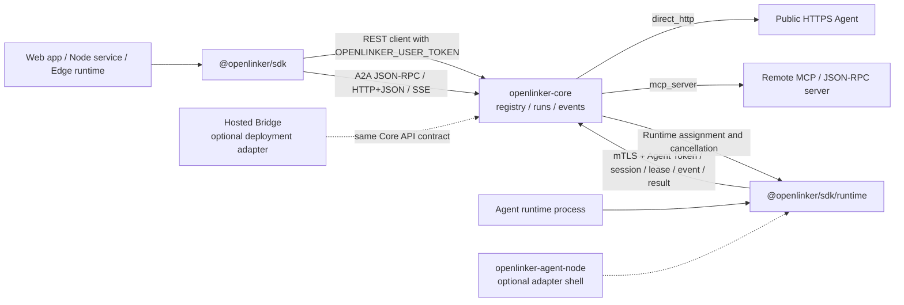

# @openlinker/sdk

`@openlinker/sdk` is the TypeScript SDK for OpenLinker Core. Use its default
entry from web apps, Node.js services, edge runtimes, and developer tools to
discover Agents, start runs, stream events, verify callbacks, and call
browser-friendly A2A JSON-RPC and HTTP+JSON/SSE bindings. Strict OpenLinker
Runtime protocol primitives use the separate `@openlinker/sdk/runtime` entry.

Chinese documentation: [README.zh-CN.md](./README.zh-CN.md)

## Status

This SDK is pre-1.0. The package tracks the Core API and runtime contracts while
they are still stabilizing. Pin versions or commits and review `CHANGELOG.md`
before upgrading.

## Install

```bash
npm install @openlinker/sdk
```

The package may still be used from this repository directly while the API
contract is being finalized.

## Open-source Architecture

The TypeScript SDK keeps caller and Agent runtime credentials separate. The
default `@openlinker/sdk` entry wraps user-token platform calls. The
`@openlinker/sdk/runtime` entry wraps Agent-token runtime calls. Neither entry
exposes hosted product internals.



## Quick Start

```ts
import { OpenLinkerClient } from "@openlinker/sdk";

const openlinker = new OpenLinkerClient({
  baseUrl: "https://core.example.com",
  userToken: process.env.OPENLINKER_USER_TOKEN,
});

const agents = await openlinker.listAgents({
  query: "data",
  callableOnly: true,
});

const idempotencyKey = crypto.randomUUID();
const run = await openlinker.startAgentRun({
  agentId: agents.items[0].id,
  input: { query: "Summarize this dataset" },
  idempotencyKey,
});

await openlinker.streamRunEvents(run.run_id, {
  onEvent(event) {
    console.log(event.event, event.data);
  },
});
```

## Reliable Run Creation

`runAgent` and `startAgentRun` send `Idempotency-Key` on every Run creation
request. Keep one key for one logical operation and reuse it when your
application retries that operation:

```ts
const idempotencyKey = crypto.randomUUID();
const request = {
  agentId: agents.items[0].id,
  input: { query: "Summarize this dataset" },
  idempotencyKey,
};

const run = await openlinker.startAgentRun(request);
// A later retry with the same key and semantic request returns the same Run.
const sameRun = await openlinker.startAgentRun(request);
console.log(sameRun.run_id, sameRun.replayed);
```

When `idempotencyKey` is omitted, the SDK generates a cryptographically strong
key once for that method invocation. That protects the request itself, but a
separate method call gets a new key and represents a new operation. Explicit
keys must be 1–255 printable ASCII characters; validation errors never include
the key value.

Core uses `201` for a newly created Run, `200` for a completed replay, and `202`
when a replayed Run is still in progress. The SDK accepts all three and exposes
the result through `RunResponse.replayed`.

## Durable Event Pages

`listRunEvents` returns an `items` page plus durable cursor metadata. The
response does not expose the former `events` alias:

```ts
const page = await openlinker.listRunEvents(run.run_id, {
  afterSequence: 0,
  limit: 100,
});

for (const event of page.items) {
  console.log(event.sequence, event.event_type, event.payload);
}

if (page.meta.retention_gap) {
  console.warn(
    `Events through sequence ${page.meta.retained_through_sequence} are no longer available`,
  );
}

if (page.meta.terminal && page.meta.stream_complete) {
  console.log("The terminal event history has been read through its latest sequence");
}
```

`requested_after_sequence` is the caller's cursor. Core advances
`effective_after_sequence` to `retained_through_sequence` when retention has
removed older events, and sets `retention_gap` so callers do not mistake the
page for a complete history. `earliest_available_sequence` and
`latest_available_sequence` are `null` when no retained event is available.
SSE continues to use `streamRunEvents` unchanged.

## OpenLinker Runtime

`RuntimeWorker` is the production entry for a self-hosted Agent process. It
discovers the dedicated Runtime origin, loads the Node mTLS identity, prefers
WebSocket, recovers through HTTP pull, manages the Session and leases, and
persists every assignment, Event, and Result before acknowledging it. The
handler is called only after Core confirms the assignment.

```ts
import {
  RuntimeWorker,
} from "@openlinker/sdk/runtime";

const worker = new RuntimeWorker({
  platformURL: "https://openlinker.example.com",
  nodeId: process.env.OPENLINKER_NODE_ID!,
  agentId: process.env.OPENLINKER_AGENT_ID!,
  agentToken: process.env.OPENLINKER_AGENT_TOKEN!,
  capacity: 1,
  transport: "auto",
  dataDir: "/var/lib/my-agent/runtime",
  mtls: {
    certFile: "/run/openlinker/node.crt",
    keyFile: "/run/openlinker/node.key",
    caFile: "/run/openlinker/core-ca.crt",
  },
  async handler(run) {
    await run.emit("run.message.delta", { text: "working" });
    return { output: { answer: 42 } };
  },
});

await worker.start();
```

By default the worker creates an encrypted `FileRuntimeStore` in `dataDir`.
The store owns a stable Worker identity and monotonic Session epoch, uses an
exclusive process lock, atomic fsync-backed writes, authenticated encryption,
private file modes, and fail-closed corruption and capacity checks.
`MemoryRuntimeStore` is only accepted when `allowUnsafeMemoryStore: true` is
set explicitly; it is intended for tests, not production.

`transport: "auto"` starts with WebSocket, falls back to pull after a socket
failure, and probes WebSocket again while pull remains available. `"ws"` and
`"pull"` pin one transport. A stale Session attachment conflict is retried
during Session creation or the initial WebSocket attach while Core reaps it;
the same conflict after Ready is a permanent business error. Cancellation and
lease revocation are matched against the complete Attempt identity. A
persisted `started` Attempt is never
re-entered after process restart; the worker fails closed instead of risking
duplicate execution. `run.callAgent(...)` requires an explicit idempotency key
and uses only the assignment-scoped invocation capability.

In Pull mode, every validated Ready response supplies the active attachment.
`OpenLinkerRuntime` stores it atomically, adds `OpenLinker-Runtime-Attachment`
to all subsequent Session and Run HTTP operations, and rejects a response if a
new attachment became active while that request was in flight. Session create,
WebSocket traffic, and capability-scoped `callRuntimeAgent` never carry this
header; callers do not manage it themselves.

The canonical WebSocket endpoint is `/api/v1/agent-runtime/ws`; HTTP methods
use the `/api/v1/agent-runtime/` prefix. Public API names and URLs are neutral;
wire compatibility is negotiated inside the handshake contract.

For protocol-level integrations, `OpenLinkerRuntime` exposes the strict HTTP
methods (`createRuntimeSession`, `claimRuntimeRun`, assignment ACK/reject,
renew, Event/Result upload, resume, command polling, cancellation ACK, and
`callRuntimeAgent`). `RuntimeWebSocketSession` exposes the correlated WebSocket
business messages over an already authenticated socket. The server-only
`@openlinker/sdk/runtime` entry also exports `NodeRuntimeTransport` for Node 20
mTLS. The default `@openlinker/sdk` entry imports none of the filesystem, TLS,
Undici, or WebSocket worker dependencies.

`openlinker-agent-node` is an optional adapter shell for HTTP, command, Codex,
or A2A handlers. It does not own a second Runtime state machine.

## Callbacks

Platform-hosted callbacks do not require a public callback URL:

```ts
const result = await openlinker.runAgentWithCallbacks({
  agentId: agents.items[0].id,
  input: { query: "Summarize this dataset" },
  callback: {
    mode: "platform",
    eventTypes: ["run.message.delta"],
    onEvent(event) {
      console.log("callback", event);
    },
  },
});
```

External webhook callbacks are available for server integrations:

```ts
import { createWebhookRunCallback } from "@openlinker/sdk";

const callback = createWebhookRunCallback({
  url: process.env.OPENLINKER_CALLBACK_URL!,
  secret: process.env.OPENLINKER_CALLBACK_SECRET,
  eventTypes: ["run.completed", "run.failed"],
});
```

Verify the raw request body before trusting webhook payloads:

```ts
import { verifyTaskCallbackHeaders } from "@openlinker/sdk";

const rawBody = await request.text();
const ok = await verifyTaskCallbackHeaders(
  rawBody,
  process.env.OPENLINKER_CALLBACK_SECRET!,
  request.headers,
);
if (!ok) {
  return new Response("invalid signature", { status: 401 });
}
```

## A2A Transports

`@openlinker/sdk` is browser-first for A2A. It supports the JSON-RPC and
HTTP+JSON/SSE bindings exposed by OpenLinker Core, including send, stream, task
lookup, task cancel, resubscribe, extended card, and Push Notification Config
methods.

It does not bundle a native gRPC client. gRPC requires Node-only dependencies
such as `@grpc/grpc-js` plus generated protobuf code, while this package must
remain safe for browsers, edge runtimes, and ordinary HTTPS infrastructure. For
gRPC callers, use `github.com/OpenLinker-ai/openlinker-go` or a separate
Node-only generated client.

Operationally, gRPC is an additional A2A transport binding. It does not replace
JSON-RPC, HTTP+JSON/SSE, or the separate OpenLinker Runtime control plane.

## Core Surface

The interim contract source is
[`contracts/core-client.v1.json`](./contracts/core-client.v1.json) and
[`contracts/core-runtime.json`](./contracts/core-runtime.json). They list
the Core endpoints this package is allowed to wrap until OpenAPI or JSON Schema
generation is in place.

Application-side calls:

- `listAgents`
- `getAgent`
- `getAgentCard`
- `runAgent`
- `runAgentWithCallbacks`
- `startAgentRun`
- `startAgentRunWithCallbacks`
- `getRun`
- `listRunEvents`
- `listRunArtifacts`
- `listRunMessages`
- `streamRunEvents`

Reliable Worker and strict Runtime protocol, from `@openlinker/sdk/runtime`:

- `RuntimeWorker`, `FileRuntimeStore`, and explicit-test `MemoryRuntimeStore`
- `OpenLinkerRuntime` and `RuntimeWebSocketSession`
- `createRuntimeSession`, heartbeat, close, and `claimRuntimeRun`
- `ackRuntimeAssignment`, `rejectRuntimeAssignment`, and `renewRuntimeLease`
- `appendRuntimeEvent`, `finalizeRuntimeResult`, and `resumeRuntimeRuns`
- `pollRuntimeCommands`, `ackRuntimeCancel`, and `callRuntimeAgent`
- `buildRuntimeInvocationProof`

## Development

```bash
npm install
npm run typecheck
npm run build
npm test
```

Optional smoke test against a running Core API:

```bash
OPENLINKER_API_ROOT=http://localhost:8080/api/v1 make validate-sdk-core-smoke
```

Authenticated run checks are only attempted when `OPENLINKER_USER_TOKEN` and
`OPENLINKER_SDK_SMOKE_RUN_ID` are set.

## Security

Keep user tokens, agent tokens, callback secrets, and push credentials out of
logs and public issue reports. Use `OPENLINKER_USER_TOKEN` with
`OpenLinkerClient`, and `OPENLINKER_AGENT_TOKEN` with `OpenLinkerRuntime`.
Browser code should use least-privilege user tokens or a server-side proxy.
Agent tokens should stay in runtime processes and should not be passed to
business adapters. Report vulnerabilities through [SECURITY.md](./SECURITY.md).

## Contributing

Read [CONTRIBUTING.md](./CONTRIBUTING.md) before opening a pull request.

## Support and Releases

- Help and issue guidance: [SUPPORT.md](./SUPPORT.md)
- Release checklist: [RELEASE.md](./RELEASE.md)
- Notable changes: [CHANGELOG.md](./CHANGELOG.md)
- Conduct expectations: [CODE_OF_CONDUCT.md](./CODE_OF_CONDUCT.md)

## License

Apache-2.0. See [LICENSE](./LICENSE).
