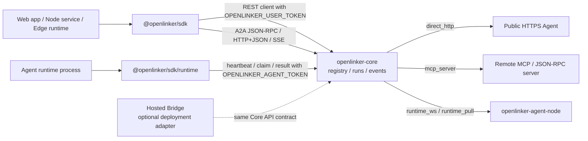

# @openlinker/sdk

`@openlinker/sdk` is the TypeScript SDK for OpenLinker Core. Use its default
entry from web apps, Node.js services, edge runtimes, and developer tools to
discover Agents, start runs, stream events, verify callbacks, and call
browser-friendly A2A JSON-RPC and HTTP+JSON/SSE bindings. Agent runtime
connectors use the separate `@openlinker/sdk/runtime` entry.

Chinese documentation: [README.zh-CN.md](./README.zh-CN.md)

## Status

This SDK is pre-1.0. The package tracks the Core API and runtime contracts while
they are still stabilizing. Pin versions or commits and review `CHANGELOG.md`
before upgrading.

## Install

```bash
npm install @openlinker/sdk
```

The package may still be used from this repository directly while the API
contract is being finalized.

## Open-source Architecture

The TypeScript SDK keeps caller and Agent runtime credentials separate. The
default `@openlinker/sdk` entry wraps user-token platform calls. The
`@openlinker/sdk/runtime` entry wraps Agent-token runtime calls. Neither entry
exposes hosted product internals.



## Quick Start

```ts
import { OpenLinkerClient } from "@openlinker/sdk";

const openlinker = new OpenLinkerClient({
  baseUrl: "https://core.example.com",
  userToken: process.env.OPENLINKER_USER_TOKEN,
});

const agents = await openlinker.listAgents({
  query: "data",
  callableOnly: true,
});

const run = await openlinker.startAgentRun({
  agentId: agents.items[0].id,
  input: { query: "Summarize this dataset" },
});

await openlinker.streamRunEvents(run.run_id, {
  onEvent(event) {
    console.log(event.event, event.data);
  },
});
```

## Runtime Entry

Agent runtime processes use `OPENLINKER_AGENT_TOKEN` through the runtime entry:

```ts
import { OpenLinkerRuntime } from "@openlinker/sdk/runtime";

const agentToken = process.env.OPENLINKER_AGENT_TOKEN;
if (!agentToken) {
  throw new Error("OPENLINKER_AGENT_TOKEN is required");
}

const runtime = new OpenLinkerRuntime({
  baseUrl: "https://core.example.com",
  agentToken,
});

await runtime.runRuntimePullLoop({
  async onAssigned(assignment) {
    const output = await handleAssignment(assignment);
    await runtime.completeRuntimeRun(assignment.run_id, {
      status: "success",
      output,
    });
  },
});
```

`OpenLinkerClient` rejects `agentToken`; use `OpenLinkerRuntime` for
`/agent-runtime/*` endpoints.

## Callbacks

Platform-hosted callbacks do not require a public callback URL:

```ts
const result = await openlinker.runAgentWithCallbacks({
  agentId: agents.items[0].id,
  input: { query: "Summarize this dataset" },
  callback: {
    mode: "platform",
    eventTypes: ["run.message.delta"],
    onEvent(event) {
      console.log("callback", event);
    },
  },
});
```

External webhook callbacks are available for server integrations:

```ts
import { createWebhookRunCallback } from "@openlinker/sdk";

const callback = createWebhookRunCallback({
  url: process.env.OPENLINKER_CALLBACK_URL!,
  secret: process.env.OPENLINKER_CALLBACK_SECRET,
  eventTypes: ["run.completed", "run.failed"],
});
```

Verify the raw request body before trusting webhook payloads:

```ts
import { verifyTaskCallbackHeaders } from "@openlinker/sdk";

const rawBody = await request.text();
const ok = await verifyTaskCallbackHeaders(
  rawBody,
  process.env.OPENLINKER_CALLBACK_SECRET!,
  request.headers,
);
if (!ok) {
  return new Response("invalid signature", { status: 401 });
}
```

## A2A Transports

`@openlinker/sdk` is browser-first for A2A. It supports the JSON-RPC and
HTTP+JSON/SSE bindings exposed by OpenLinker Core, including send, stream, task
lookup, task cancel, resubscribe, extended card, and Push Notification Config
methods.

It does not bundle a native gRPC client. gRPC requires Node-only dependencies
such as `@grpc/grpc-js` plus generated protobuf code, while this package must
remain safe for browsers, edge runtimes, and ordinary HTTPS infrastructure. For
gRPC callers, use `github.com/OpenLinker-ai/openlinker-go` or a separate
Node-only generated client.

Operationally, gRPC is an additional A2A transport binding. It does not replace
JSON-RPC, HTTP+JSON/SSE, or Agent Node's internal `runtime_ws` /
`runtime_pull` channels.

## Core Surface

The interim contract source is
[`contracts/core-client.v1.json`](./contracts/core-client.v1.json) and
[`contracts/core-runtime.v1.json`](./contracts/core-runtime.v1.json). They list
the Core endpoints this package is allowed to wrap until OpenAPI or JSON Schema
generation is in place.

Application-side calls:

- `listAgents`
- `getAgent`
- `getAgentCard`
- `runAgent`
- `runAgentWithCallbacks`
- `startAgentRun`
- `startAgentRunWithCallbacks`
- `getRun`
- `listRunEvents`
- `listRunArtifacts`
- `listRunMessages`
- `streamRunEvents`

Agent runtime protocol, from `@openlinker/sdk/runtime`:

- `heartbeatAgent`
- `claimRuntimeRun`
- `claimRuntimeRunDetailed`
- `completeRuntimeRun`
- `callAgent`
- `callAgentAt`
- `runRuntimePullLoop`
- `connectRuntimeWebSocket`

## Development

```bash
npm install
npm run typecheck
npm run build
npm test
```

Optional smoke test against a running Core API:

```bash
OPENLINKER_API_ROOT=http://localhost:8080/api/v1 make validate-sdk-core-smoke
```

Authenticated run checks are only attempted when `OPENLINKER_USER_TOKEN` and
`OPENLINKER_SDK_SMOKE_RUN_ID` are set.

## Security

Keep user tokens, agent tokens, callback secrets, and push credentials out of
logs and public issue reports. Use `OPENLINKER_USER_TOKEN` with
`OpenLinkerClient`, and `OPENLINKER_AGENT_TOKEN` with `OpenLinkerRuntime`.
Browser code should use least-privilege user tokens or a server-side proxy.
Agent tokens should stay in runtime processes and should not be passed to
business adapters. Report vulnerabilities through [SECURITY.md](./SECURITY.md).

## Contributing

Read [CONTRIBUTING.md](./CONTRIBUTING.md) before opening a pull request.

## Support and Releases

- Help and issue guidance: [SUPPORT.md](./SUPPORT.md)
- Release checklist: [RELEASE.md](./RELEASE.md)
- Notable changes: [CHANGELOG.md](./CHANGELOG.md)
- Conduct expectations: [CODE_OF_CONDUCT.md](./CODE_OF_CONDUCT.md)

## License

Apache-2.0. See [LICENSE](./LICENSE).
