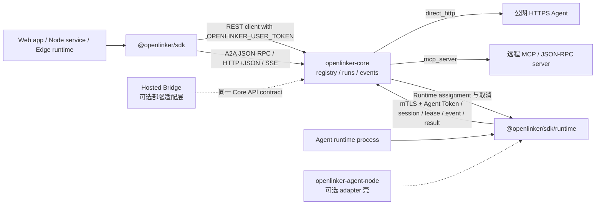

# @openlinker/sdk

`@openlinker/sdk` 是 OpenLinker Core 的 TypeScript SDK。默认入口用于在 Web 应用、
Node.js 服务、Edge runtime 和开发者工具中查找 Agent、启动运行、监听事件、校验回调，
并调用浏览器友好的 A2A JSON-RPC 与 HTTP+JSON/SSE 接口。严格的 OpenLinker Runtime
协议原语使用单独的 `@openlinker/sdk/runtime` 入口。

English documentation: [README.md](./README.md)

## 状态

本 SDK 目前是 pre-1.0。它跟随 Core API 和 runtime 契约演进。升级前请固定版本或
commit，并阅读 [CHANGELOG.md](./CHANGELOG.md)。

本 SDK 不内置原生 gRPC 客户端，也不包含钱包、扣费、Stripe、提现、商业 Dashboard
或本地 adapter 实现。默认入口使用 `OPENLINKER_USER_TOKEN`，runtime 入口使用
`OPENLINKER_AGENT_TOKEN`。
## 开源架构图

TypeScript SDK 把调用方凭证和 Agent runtime 凭证分开。默认 `@openlinker/sdk`
入口封装 user-token 平台调用；`@openlinker/sdk/runtime` 入口封装 agent-token
runtime 调用。两者都不暴露托管产品内部接口。



## 安装

```bash
npm install @openlinker/sdk
```

API 契约稳定前，也可以直接从本仓库目录使用该 package。

## 快速开始

```ts
import { OpenLinkerClient } from "@openlinker/sdk";

const openlinker = new OpenLinkerClient({
  baseUrl: "https://core.example.com",
  userToken: process.env.OPENLINKER_USER_TOKEN,
});

const agents = await openlinker.listAgents({
  query: "data",
  callableOnly: true,
});

const idempotencyKey = crypto.randomUUID();
const run = await openlinker.startAgentRun({
  agentId: agents.items[0].id,
  input: { query: "Summarize this dataset" },
  idempotencyKey,
});

await openlinker.streamRunEvents(run.run_id, {
  onEvent(event) {
    console.log(event.event, event.data);
  },
});
```

浏览器代码不要直接暴露高权限 token。需要时使用低权限 token 或服务端代理。

## 可靠创建 Run

`runAgent` 和 `startAgentRun` 每次创建 Run 都会发送 `Idempotency-Key`。一次业务操作只用
一个 key；应用层重试时复用它，Core 就会返回同一个 Run：

```ts
const idempotencyKey = crypto.randomUUID();
const request = {
  agentId: agents.items[0].id,
  input: { query: "Summarize this dataset" },
  idempotencyKey,
};

const run = await openlinker.startAgentRun(request);
// 同一个 key 与同一份语义请求再次调用，仍然返回原来的 Run。
const sameRun = await openlinker.startAgentRun(request);
console.log(sameRun.run_id, sameRun.replayed);
```

不传 `idempotencyKey` 时，SDK 会为本次方法调用生成一个密码学安全的 key。它只代表这
一次调用；下一次方法调用会生成新 key，也就代表一项新操作。显式 key 必须是 1–255 个
可打印 ASCII 字符，校验错误不会带出 key 原文。

Core 对首次创建返回 `201`，对已结束的重放返回 `200`，对仍在运行的重放返回 `202`。
SDK 会透明处理这三种状态，可通过 `RunResponse.replayed` 判断是否为重放。

## OpenLinker Runtime

`RuntimeWorker` 是自托管 Agent 进程的生产入口。它会发现 Runtime 专用地址，加载 Node
mTLS 身份，优先连接 WebSocket，并在连接异常时用 HTTP Pull 恢复；Session、续租、resume、
取消、drain、assignment 确认以及 Event/Result 上传都由它统一管理。只有 Core 明确确认
assignment 且该状态已经落盘后，handler 才会运行。

```ts
import {
  RuntimeWorker,
} from "@openlinker/sdk/runtime";

const worker = new RuntimeWorker({
  platformURL: "https://openlinker.example.com",
  nodeId: process.env.OPENLINKER_NODE_ID!,
  agentId: process.env.OPENLINKER_AGENT_ID!,
  agentToken: process.env.OPENLINKER_AGENT_TOKEN!,
  capacity: 1,
  transport: "auto",
  dataDir: "/var/lib/my-agent/runtime",
  mtls: {
    certFile: "/run/openlinker/node.crt",
    keyFile: "/run/openlinker/node.key",
    caFile: "/run/openlinker/core-ca.crt",
  },
  async handler(run) {
    await run.emit("run.message.delta", { text: "working" });
    return { output: { answer: 42 } };
  },
});

await worker.start();
```

默认情况下，worker 会在 `dataDir` 创建加密的 `FileRuntimeStore`。它保存稳定的 Worker
身份和单调递增的 Session epoch，并提供进程排他锁、原子写入、fsync、认证加密、私有文件
权限、损坏检测和容量保护。任何一项不满足都会 fail closed。`MemoryRuntimeStore` 只在显式
设置 `allowUnsafeMemoryStore: true` 时可用，适合测试，不适合生产。

`transport: "auto"` 会先用 WebSocket，断线后切到 Pull，并在 Pull 可用期间继续探测
WebSocket。`"ws"` 和 `"pull"` 可以固定单一 transport。Session create 或 WebSocket 首次
attach 遇到旧连接尚在回收的冲突时会退避重试；Ready 之后再出现同一冲突则按永久业务错误
处理。取消和 lease revoke 会核对完整
Attempt identity。进程重启后如果发现某个 Attempt 已经越过 `started` 边界，worker 不会
再次调用 handler，而是直接拒绝不安全恢复。`run.callAgent(...)` 必须传显式幂等 key，且
只使用本 assignment 下发的调用能力，不会把长期 Agent Token 交给 handler。

WebSocket 的标准端点是 `/api/v1/agent-runtime/ws`，HTTP 方法统一使用
`/api/v1/agent-runtime/` 前缀。公开 API 名和 URL 使用中性命名；wire 兼容性只在握手
contract 内协商。

需要直接操作协议时，可使用 `OpenLinkerRuntime` 的严格 HTTP 方法，以及
`RuntimeWebSocketSession` 的关联式 WebSocket 消息。Node 20 下的 mTLS HTTP/WS transport
由 `NodeRuntimeTransport` 提供。它们只从 server-only 的 `@openlinker/sdk/runtime` 导出；
默认 `@openlinker/sdk` 入口不会引入文件系统、TLS、Undici 或 WebSocket 依赖。

`openlinker-agent-node` 现在只是 HTTP、command、Codex 或 A2A handler 的可选 adapter 壳，
不再拥有另一套 Runtime 状态机。

## Callback

平台托管 callback 不需要公网 callback URL。外部 webhook callback 适合服务端集成。
处理 webhook 时必须先校验原始请求体签名，再信任 payload。

## A2A Transport

`@openlinker/sdk` 是 browser-first 的 A2A SDK。它支持 OpenLinker Core 暴露的 JSON-RPC
和 HTTP+JSON/SSE binding，包括 send、stream、task lookup、task cancel、resubscribe、
extended card 和 Push Notification Config 方法。

它不内置原生 gRPC client。gRPC 需要 Node-only 依赖和生成的 protobuf code，而本包需要
保持浏览器、Edge runtime 和普通 HTTPS 基础设施友好。gRPC 调用方可使用
`github.com/OpenLinker-ai/openlinker-go` 或单独的 Node-only generated client。

## Core Surface

临时契约来源：

- [`contracts/core-client.v1.json`](./contracts/core-client.v1.json)
- [`contracts/core-runtime.json`](./contracts/core-runtime.json)

这些文件列出本包在 OpenAPI / JSON Schema 生成稳定前允许封装的 Core endpoint。

## 开发

```bash
npm install
npm run typecheck
npm run build
npm test
```

可选：对运行中的 Core API 做 smoke test：

```bash
OPENLINKER_API_ROOT=http://localhost:8080/api/v1 make validate-sdk-core-smoke
```

## 安全

不要把 user token、agent token、callback secret 或 push credential 写入日志或公开 Issue。
`OPENLINKER_USER_TOKEN` 用于 `OpenLinkerClient`，`OPENLINKER_AGENT_TOKEN` 用于
`OpenLinkerRuntime`。浏览器代码应使用最小权限 user token 或服务端代理；agent token
应留在 runtime 进程内，不要传给业务 adapter。漏洞请通过 [SECURITY.zh-CN.md](./SECURITY.zh-CN.md)
报告。

## 贡献

提交 PR 前请阅读 [CONTRIBUTING.zh-CN.md](./CONTRIBUTING.zh-CN.md)。SDK 只封装开源 Core
协议，不加入 Cloud 钱包、商业计费或托管市场内部接口。公共 API 变化要同步测试和契约文件。

## 支持和发布

- 支持说明：[SUPPORT.zh-CN.md](./SUPPORT.zh-CN.md)
- 发布清单：[RELEASE.zh-CN.md](./RELEASE.zh-CN.md)
- 英文变更记录：[CHANGELOG.md](./CHANGELOG.md)
- 行为准则：[CODE_OF_CONDUCT.md](./CODE_OF_CONDUCT.md)

## 许可证

Apache-2.0。详见 [LICENSE](./LICENSE)。
